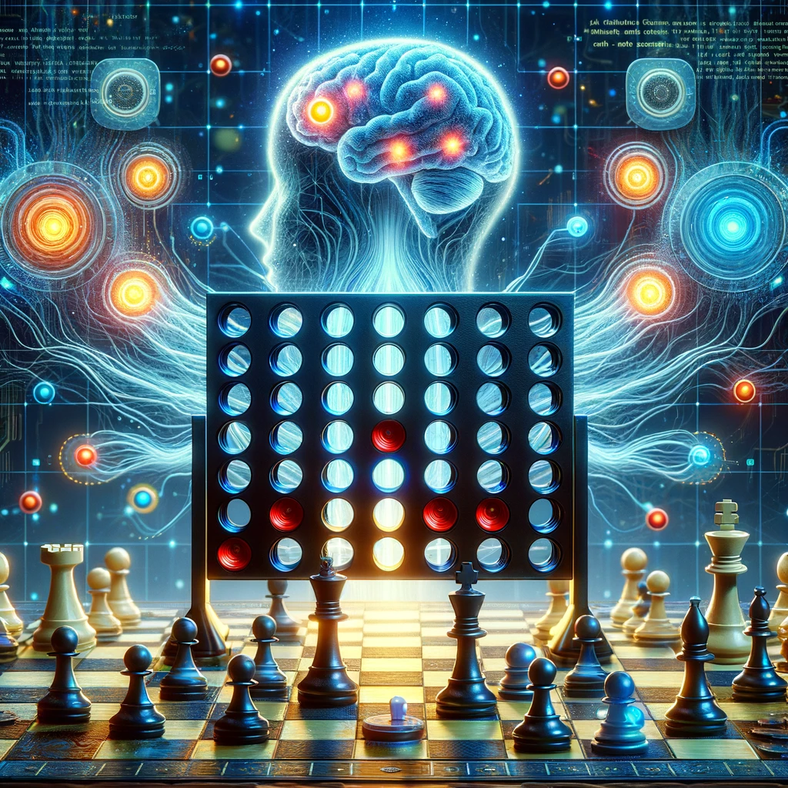
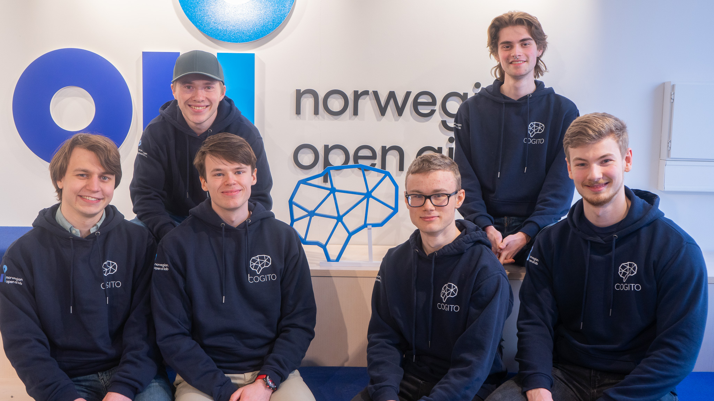

<div id="top"></div>


<div align="center">
</img>
</div>

<p align="center">
<a href="" alt="version">
        </img></a>
<a href="https://github.com/CogitoNTNU/README-template/blob/main/LICENSE" alt="LICENSE">
        </img></a>
<a href="" alt="platform">
        </img></a>
<a href="" alt="version">
        </img></a>

</p>

<details>
  <summary>Table of Contents</summary>
  <ol>
    <li>
      <a href="#about">About</a>
    </li>
    <li>
      <a href="#getting-started">Getting Started</a>
      <ul>
        <li><a href="#prerequisites">Prerequisites</a></li>
        <li><a href="#installation">Installation</a></li>
        <li><a href="#running-tests">Running Tests</a></li>
      </ul>
    </li>
    <li>
      <a href="#usage">Usage</a>
      <ul>
        <li><a href="#running-main-with-command-line-flags">Running main with command line flags</a></li>
        <li><a href="#examples-of-usage">Examples of usage</a></li>
      </ul>
    </li>
    <li><a href="#team">Team</a></li>
    <li><a href="#license">License</a></li>
  </ol>
</details>

## About

-----

This project, initiated by Cogito NTNU, embarks on the ambitious journey of exploring deep reinforcement learning within the realm of board games. At its core, the project aims to harness the power of advanced AI algorithms, starting with an implementation of AlphaZero, before advancing to the more complex and sophisticated MuZero.

Our journey begins with Connect Four, serving as a testing ground and proof of concept. This classic game provides an ideal platform for fine-tuning our approach and algorithms, ensuring they are robust and effective. Once perfected, our endeavor will escalate to the intricate and revered game of chess. The ultimate goal is to develop an AI that not only competes at but excels in chess, demonstrating profound strategic depth and understanding.

This endeavor not only highlights Cogito NTNU's commitment to pushing the boundaries of AI and machine learning but also underscores our passion for blending technology with traditional games, revealing new dimensions of play and strategy. Join us as we explore the frontiers of artificial intelligence, one game at a time.

## Getting Started

This section provides a comprehensive guide to setting up and running the project. By following the steps outlined below, you'll be prepared to embark on a journey of deep reinforcement learning with board games, starting with Connect Four and progressing to Chess.

-----

### Prerequisites

Before you begin, ensure that your system meets the following requirements:

- **Operating System**: Linux or macOS is required for the core functionality of this project due to its dependency on the OpenSpiel library. Windows users can participate by setting up the Windows Subsystem for Linux (WSL).
- **Python Libraries**: Essential libraries such as NumPy and PyTorch are necessary. These are listed in the `requirements.txt` file for easy installation.
- **Hardware**: For optimal performance, an NVIDIA GPU with CUDA installed is recommended. Running deep reinforcement learning models, especially for complex games like chess, is computationally intensive and may not be feasible on CPU alone.

### Installation

1. **Clone the Project**: Begin by cloning the repository to your local machine or development environment.

   ```bash
   git clone https://github.com/CogitoNTNU/MuZero
    ```

2. **Install Dependencies**: Navigate to the project directory and install the required Python libraries using pip.

   ```bash
   pip install -r requirements.txt
    ```

### Running Tests

To ensure that the project is set up correctly and functioning as expected, run the tests using the following command:

```bash
pytest
```

If you want to add print statements to the tests to debug, write your code of choice and run the following command:

```bash
pytest -s
```

## Usage

### Running main with Command Line Flags

main.py is configured to handle different gameplay and training scenarios for the AlphaZero implementation via command line flags. Below are the available flags and their descriptions:

`--test_overfit`: Test overfitting on the Connect Four game model.

`--train_tic_tac_toe`: Train the AlphaZero model on Tic Tac Toe.

`--train_connect_four`: Execute extended training sessions for the Connect Four game.

`--self_play_ttt`: Run self-play simulations on the Tic Tac Toe model.

`--self_play_c4`: Run self-play simulations on the Connect Four model.

`--play_ttt`: Play against the AlphaZero model in Tic Tac Toe.

`--play_c4`: Play against the AlphaZero model in Connect Four.

`--first` or `-f` : The first player is the human player.

`--mcts` or `-m` : Alphazero plays against MCTS instead of human player.

### Examples of Usage

Here are examples of how to run main.py with the available flags from a Bash shell:

``` bash
# Test overfitting on Connect Four
python main.py --test_overfit

# Train AlphaZero on Tic Tac Toe
python main.py --train_ttt

# Train AlphaZero on Connect Four
python main.py --train_c4

# Run self-play on Tic Tac Toe
python main.py --self_play_ttt

# Run self-play on Connect Four
python main.py --self_play_c4

# Play as player2 against AlphaZero on Tic Tac Toe
python main.py --play_ttt

# Play as player2 against AlphaZero on Connect Four
python main.py --play_c4

# Play as player1 against AlphaZero on Connect Four
python main.py --play_c4 -f

# Let Alphazero play as player1 against MCTS
python main.py --play_c4 -m

# Let AlphaZero play as player2 against MCTS
python main.py --play_c4 -f -m 
```

-----

By adhering to the above guidelines, you'll be well-prepared to contribute to or experiment with this cutting-edge exploration into deep reinforcement learning for board games. Whether you're a developer, a researcher, or an enthusiast, your journey into AI and strategic gameplay starts here.

## Team

-----

<div align="center">
</img>
</div>

Back row left to right: [Nils Henrik Lund](https://github.com/Nilsthehacker), [Haagen Mæland Moe](https://github.com/Thesmund)

Front row left to right: [Kristian Carlenius](https://github.com/kristiancarlenius), [Ludvig Øvrevik](https://github.com/ludvigovrevik), [Christian Fredrik Johnsen](https://github.com/ChristianFredrikJohnsen), [Brage Kvamme](https://github.com/BrageHK)

#### Leaders

- [Christian Fredrik Johnsen](https://github.com/ChristianFredrikJohnsen)
  
- [Brage Kvamme](https://github.com/BrageHK)

#### Team members

- [Ludvig Øvrevik](https://github.com/ludvigovrevik)

- [Kacper Pawlowski](https://github.com/kapi0okapi)

- [Kristian Carlenius](https://github.com/kristiancarlenius)

- [Nils Henrik Lund](https://github.com/Nilsthehacker)

- [Haagen Mæland Moe](https://github.com/Thesmund)
  
### License

-----
Distributed under the MIT License. See `LICENSE` for more information.

### Credits

-----
Template by [@JonRodtang](https://github.com/Jonrodtang) for  [@CogitoNTNU](https://github.com/CogitoNTNU)  <p align="right">(<a href="#top">back to top</a>)</p>
