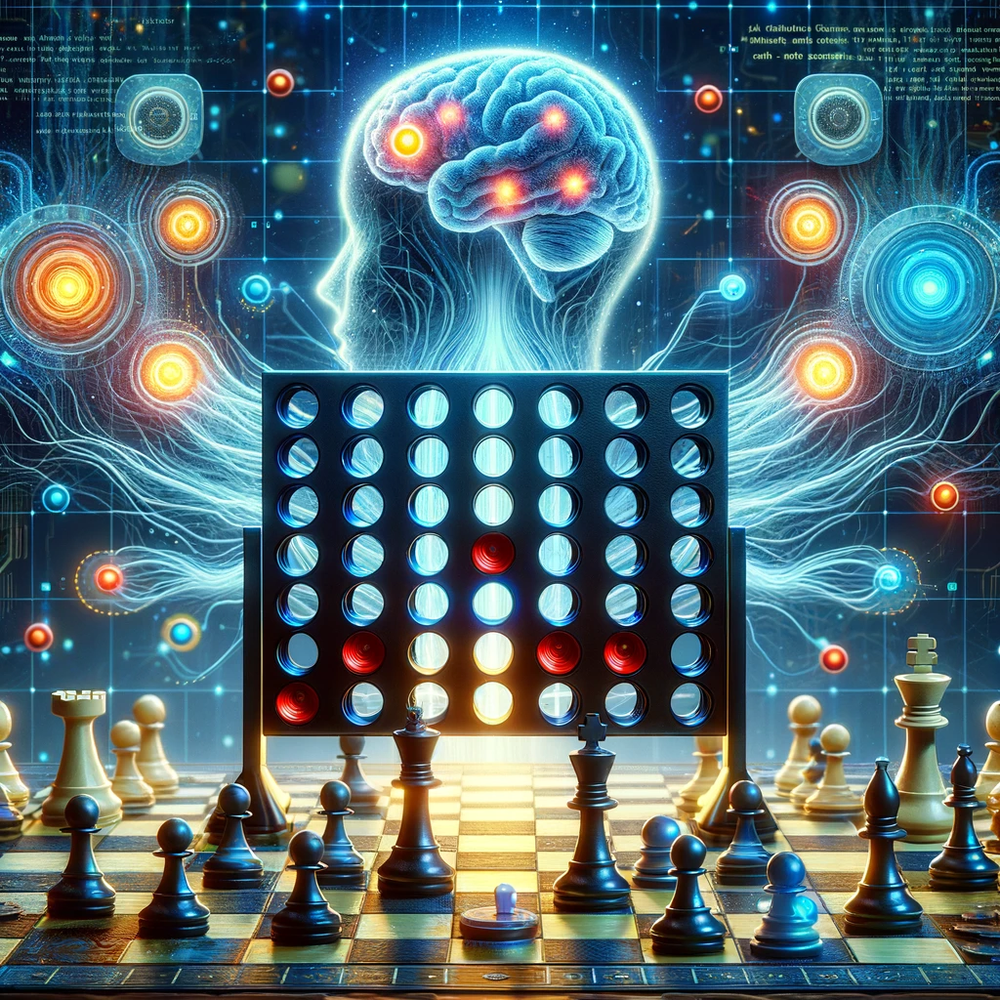
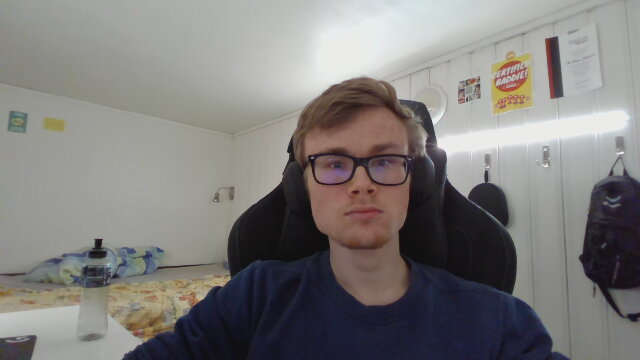

<div id="top"></div>


<div align="center">
</img>
</div>

<p align="center">
<a href="https://github.com/CogitoNTNU/README-template/blob/main/LICENSE" alt="LICENSE">
        </img></a>
<a href="" alt="platform">
        </img></a>
<a href="" alt="version">
        </img></a>
</p>

<details>
  <summary>Table of Contents</summary>
  <ol>
    <li>
      <a href="#about">About</a>
    </li>
    <li>
      <a href="#getting-started">Getting Started</a>
      <ul>
        <li><a href="#prerequisites">Prerequisites</a></li>
        <li><a href="#installation">Installation</a></li>
      </ul>
    </li>
    <li><a href="#usage">Usage</a></li>
   <li><a href="#team">Team</a></li>
    <li><a href="#license">License</a></li>
  </ol>
</details>

### About

-----

This project, initiated by Cogito NTNU, embarks on the ambitious journey of exploring deep reinforcement learning within the realm of board games. At its core, the project aims to harness the power of advanced AI algorithms, starting with an implementation of AlphaZero, before advancing to the more complex and sophisticated MuZero.

Our journey begins with Connect Four, serving as a testing ground and proof of concept. This classic game provides an ideal platform for fine-tuning our approach and algorithms, ensuring they are robust and effective. Once perfected, our endeavor will escalate to the intricate and revered game of chess. The ultimate goal is to develop an AI that not only competes at but excels in chess, demonstrating profound strategic depth and understanding.

This endeavor not only highlights Cogito NTNU's commitment to pushing the boundaries of AI and machine learning but also underscores our passion for blending technology with traditional games, revealing new dimensions of play and strategy. Join us as we explore the frontiers of artificial intelligence, one game at a time.

### Getting Started

This section provides a comprehensive guide to setting up and running the project. By following the steps outlined below, you'll be prepared to embark on a journey of deep reinforcement learning with board games, starting with Connect Four and progressing to Chess.

-----

#### Prerequisites

Before you begin, ensure that your system meets the following requirements:

- **Operating System**: Linux or macOS is required for the core functionality of this project due to its dependency on the OpenSpiel library. Windows users can participate by setting up the Windows Subsystem for Linux (WSL).
- **Python Libraries**: Essential libraries such as NumPy and PyTorch are necessary. These are listed in the `requirements.txt` file for easy installation.
- **Hardware**: For optimal performance, an NVIDIA GPU with CUDA installed is recommended. Running deep reinforcement learning models, especially for complex games like chess, is computationally intensive and may not be feasible on CPU alone.

#### Installation

1. **Clone the Project**: Begin by cloning the repository to your local machine or development environment.

   ```bash
   git clone https://github.com/CogitoNTNU/MuZero
    ```

2. **Install Dependencies**: Navigate to the project directory and install the required Python libraries using pip.

   ```bash
   pip install -r requirements.txt
    ```

#### Usage

As the project is currently under development, specific usage instructions are pending. Once the project reaches a runnable state, detailed steps on how to initiate training sessions, as well as how to utilize the AI for playing Connect Four and Chess, will be provided here. Stay tuned for updates on how to leverage this AI to challenge the strategic depths of these classic board games.

-----

By adhering to the above guidelines, you'll be well-prepared to contribute to or experiment with this cutting-edge exploration into deep reinforcement learning for board games. Whether you're a developer, a researcher, or an enthusiast, your journey into AI and strategic gameplay starts here.

### Team

-----

<!--INSERT PICTURE OF TEAM-->
<div align="center">
</img>
</div>

Left to right: [@example](https://github.com/Jonrodtang)    [@example](https://github.com/Jonrodtang)    [@example](https://github.com/Jonrodtang)    [@example](https://github.com/Jonrodtang)  

#### Leaders

- [Christian Fredrik Johnsen](https://github.com/ChristianFredrikJohnsen)
  
- [Brage Kvamme](https://github.com/BrageHK)

#### Team members

- [Ludvig Øvrevik](https://github.com/ludvigovrevik)

- [Kacper Pawlowski](https://github.com/kapi0okapi)

- [Kristian Carlenius](https://github.com/kristiancarlenius)

- [Nils Henrik Lund](https://github.com/Nilsthehacker)

- [Haagen Mæland Moe](https://github.com/Thesmund)
  
### License

-----
Distributed under the MIT License. See `LICENSE` for more information.

### Credits

-----
Template by [@JonRodtang](https://github.com/Jonrodtang) for  [@CogitoNTNU](https://github.com/CogitoNTNU)  <p align="right">(<a href="#top">back to top</a>)</p>
